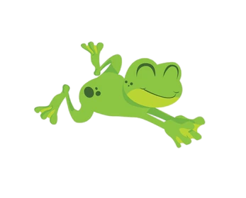

<!-- button to start -->

<input type="text" id="distanceGoal" name="distanceGoal" placeholder="Enter desired distance here (integer, max 30)"
    style="width: 50%;
  padding: 5px 5px;
  margin: 8px 0;
  box-sizing: border-box
  border: 2px solid #000000;
  border-radius: 40px;
  color: black;">
  <input type="text" id="maxHops" name="maxHops" placeholder="Enter maximum Hops (integer, max 6)"
    style="width: 50%;
  padding: 5px 5px;
  margin: 8px 0;
  box-sizing: border-box;
  border: 2px solid #000000;
  border-radius: 40px;
  color: black;">
    <button type="submit" onclick="startSimulation()">Begin Simulation</button>

<!-- button to generate jump distance -->

    <button type="submit" onclick="jumpDistance()">Get Next Jump Distance</button>

<!-- button to generate positive or negative -->

    <button type="submit" onclick="jumpSign()">Get Next Jump Sign</button>

<body>

<ul style="color: white">
  <li>Distance Goal: 

 </li>
  <li>Maximum hops allowed: 

 </li>
  <li>Next Hop Distance: 

 </li>
  <li>Next Hop Direction: 

 </li>
</ul>
</body>

<html>
<head>
  
</head>

<body>
<!-- button to move frog -->

    <button type="submit" onclick="moveFrog()">Move Frog</button>

   

    
  
</body>
</html>
