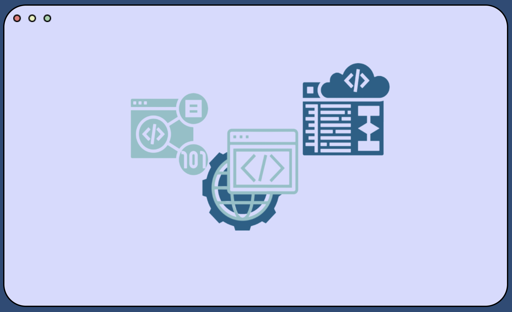

<head>
    <meta name="viewport" content="width=device-width, initial-scale=1.0">
</head>

<body>

    

    

    

      
    

    

      <button id='buttonprimary' class='buttonprimary'>
        

        

        

          Start

      </button>
      

        Learn how to ace your AP CSA test with our interactive features!

      

        Find All Your FRQs In One Place

    

  

   
   
  

   
   
    <a style="color:#011627; font-size:50px; margin-left: 34%; font-family: Ubuntu">Most Popular FRQs</a>
     
     
    

        

            <button class="columnbox"></button>
        

        

            <button class="columnbox"></button>
        

        

            <button class="columnbox"></button>
        

    

  

  

    